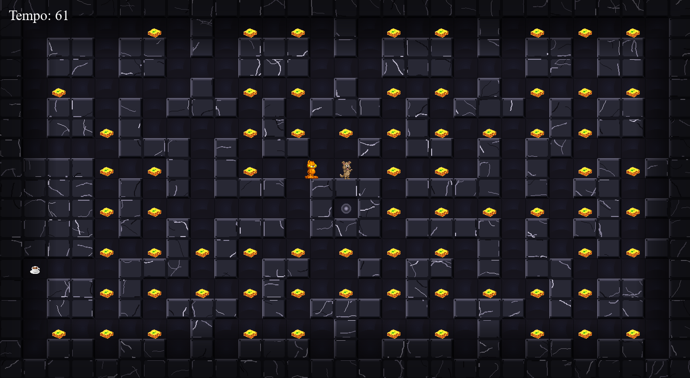

# Let\_Him\_Eat

🍝 Let Him Eat – Il gioco dove la fame è una missione! ☕

Preparati a entrare in un labirinto pieno di insidie nei panni del mitico Garfield!
Il tuo obiettivo? Mangiare tutte le lasagne prima che il tempo finisca… ma non sarà così semplice.

Un nemico affamato ti insegue senza sosta e ogni errore potrebbe costarti la partita.
Per sopravvivere dovrai muoverti con astuzia tra i corridoi, evitare i muri e sfruttare al meglio i caffè, che ti daranno una preziosa accelerazione per scappare nei momenti critici.

Riuscirai a mangiare tutte le lasagne e vincere… o verrai catturato prima?

Let Him Eat è un mix di strategia, riflessi e adrenalina: semplice da giocare, difficile da padroneggiare.

Paolo ha fatto l'Initial commit.\n
Andrea ha creato il progetto.\n
Paolo ha aggiunto l'immagine dello sfondo.\n
Paolo, Andrea e Dmytro hanno lavorato sul codice. Creazione pulsanti, scritte, muri.\n
Paolo ha creato la funzione movimento player con il supporto dell' I.A.\n
Paolo, Andrea aggiunto immagini.\n
Andrea ha aggiunto la musica.\n
Paolo ha creato la funzione movimento nemico con il supporto dell' I.A.\n
Paolo ha aggiunto il file record.\n
Andrea ha aggiunto altre immagine.\n
Andrea ha aggiunto le immagini del nemico.\n